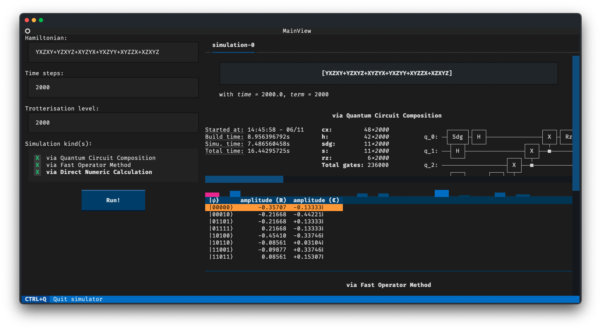

# Terminal Hamiltonian Simulator
 
Ever wanted a nice terminal-based interface for simulating the time evolution of Pauli-string hamiltonian systems? Well, consider your extremely specific wish partially fulfilled!

## Features
- Qiskit based simulation of pauli string hamiltonians, using trotterisation for multi-term pauli inputs.
- Implementation using [textual](https://github.com/Textualize/textual) and [rich](https://github.com/Textualize/rich) for fully interactive, in-terminal niceties. 
- Asynchronous job handling, so no locking of the interface while waiting on results. 
- Multiple kinds of simulation options: 
  - Qiskit trotterised quantum circuit method, in which gates are composed to make a simulation that could be run on a quantum computer efficiently. 
  - Qiskit operator method, which reduces the overall complexity and memory size of the model, allowing for simulations of a much higher accuracy, with terms of 1M+ being simulated within fractions of a second. 
  - Direct matrix exponentiation method, using [scipy](https://scipy.org)'s `scipy.linalg.expm` method. 
- Formatted amplitude and probability outputs, with a sparkline representing the overall outcomes of the final statevector. 
## Installation 
We recommend [poetry](https://python-poetry.org) for dependency management, but instructions will also be included for using `pip`.

This package requires python `v3.11.6`! This constraint is because of Qiskit, not me! `pyenv` highly recommended! 

### Common step
1. Pull the github repo: 
   1. `git clone https://github.com/Navrin/hamiltonian-evo-simulator-uts41173 hamiltonian-sim`
   2. `cd hamiltonian-sim`

### `poetry` (recommended)
1. Activate the virtual env:
   1. `poetry env use 3.11.6`
   2. `poetry shell`
2. Install requirements
   1. `poetry install`
3. Install develop requirements (optional)
   1. `poetry install --with=dev`
4. Run entry.py
   1. `python ./hamil_clever_sim/entry.py`
### `pip` 
1. Create the virtualenv and activate
   1. `python -m venv .env`
   2. `chmod +x .env/bin/activate`
   3. `.env/bin/activate`
2. Install requirements 
   1. `pip install -r requirements.txt`
3. OR Install develop requirements (optional)
   1. `pip install -r requirements-dev.txt`
4. Run entry.py
   1. `python ./hamil_clever_sim/entry.py`
### `docker`
In classic developer fashion, why do work when someone else has already done it for you!
A docker image is available on [docker hub](https://hub.docker.com/r/navrin/hamil-sim). You can run this via `docker run -it navrin/hamil-sim`

## Usage

Usage is fairly straightforward. The application consists of two sections, the input area on the left and the output display on the right. 

You can use tab navigation or click with your mouse to interact with the TUI. 

Enter your simulation details in the form and select at least one kind of simulation, and press run. A new tab will open with the current details of the simulation. Each simulation runs in its own render non-blocking thread, and some information will update as various build/sim stages occur. 

Most inputs will not pass the regex/validation, but some invalid inputs may still be passed. The program will warn you as a notification if something seems off, otherwise it will close on exception.

## Documentation

[Hosted documentation can be found here.](https://hamil-sim.uts.navr.in/_autosummary/hamil_clever_sim.html) This is for API referencing, generated from the docstrings. 

## Licensing 

This project uses the MIT license, feel free to do whatever with it, within the bounds of whatever University of Technology Sydney deems acceptable for content derived from course material. 

